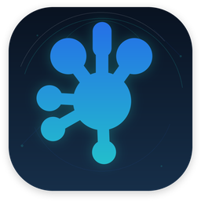

<p align="center">
    
</p>

<h1 align="center">OpenHub</h1>

<p align="center"><strong>A local-first alternative to Logitech G HUB for Linux, written in Rust 🦀<br/>
Per-game profiles, macros, DPI and lighting for Logitech G gaming mice — no account, no telemetry, plain-TOML config.</strong></p>

<p align="center">
    
    
    
</p>

---

> [!WARNING]
> **OpenHub is in early development.** Gaming-mouse recognition (HID++
> `0x8100`) and the macro engine — repeat-while-held, verified on real
> hardware — are in. Per-game profiles, the G-Shift layer and every GUI
> screen for the above are not: today a macro is bound by editing
> `config.toml` by hand. `docs/superpowers/STATUS.md` says exactly where
> things stand.

## Why this exists

Logitech's G HUB does not run on Linux, and it cannot be made to: it installs a
kernel-level HID filter driver, which Wine cannot emulate. The tools that do
exist on Linux stop short of what a gaming mouse actually needs.

- **libratbag / Piper** writes to the mouse's onboard memory, but its macros are
  one-shot. There is no "repeat while the button is held", which is the mode
  most gaming macros actually use, and no modifier layer.
- **OpenLogi**, which this project forks, is excellent — but it targets Logitech
  *Options+* and productivity mice. It discovers remappable buttons through HID++
  feature `0x1b04`, which gaming mice do not expose. A G703 shows up in OpenLogi
  with no buttons at all.

OpenHub picks up where both stop: the HID++ features that gaming hardware
actually exposes, and a macro engine that behaves like G HUB's.

## What OpenHub adds

| | |
|---|---|
| **Per-game profiles** | A profile is a first-class object with a name and a game attached. It activates on window focus and, unlike G HUB's, it is level-reconciled: a missed focus reading corrects itself on the next tick instead of leaving you alt-tabbing until the profile catches up. |
| **Macros that repeat** | The three G HUB modes — no repeat, repeat while held, toggle — with press/release granularity, so `Alt↓ V↕ Alt↑` is expressible. No key is ever left stuck: every exit path emits its releases. |
| **G-Shift** | Every button carries two assignments. Hold the button bound to G-Shift and the rest switch to their second assignment. |
| **Gaming HID++** | Feature `0x8100` (onboard profiles), which is where gaming mice keep their buttons, DPI presets, report rate and lighting, and `0x8110` (button spy). |
| **A model table, not code** | Supporting another mouse is filling in a row: its button slots, evdev codes and HID++ control IDs. |

## What it inherits from OpenLogi

The hard half was already solved, and this fork keeps all of it: the HID++
protocol stack and receiver handling, device enumeration and pairing, input
capture and synthesis on Linux, macOS and Windows, the agent↔GUI IPC layer,
foreground-application detection on Wayland, TOML configuration, and a GPUI
desktop application that renders each device with clickable button hotspots.

## Hardware

Verified against real hardware:

| Device | Transport | Status |
|---|---|---|
| Logitech G703 LIGHTSPEED HERO | Lightspeed receiver **and** USB cable | Reference device. HID++ 4.2, 29 features, reads and writes confirmed over wireless. |

Every other Logitech device that OpenLogi supports keeps working, since none of
that code was removed. Gaming-specific features are only implemented for the
device above so far.

## Building

```sh
# Toolchain: rustup with the pinned stable in rust-toolchain.toml (1.98+)
sudo apt install -y libudev-dev clang libfontconfig-dev libwayland-dev \
    libxkbcommon-x11-dev libx11-xcb-dev libssl-dev libzstd-dev pkg-config

cargo build --release
cargo run -p openlogi-desktop
```

Development handbook: [docs/DEVELOPMENT.md](docs/DEVELOPMENT.md).
Linux installation and udev rules: [docs/INSTALL-linux.md](docs/INSTALL-linux.md).

On GNOME running Wayland, per-game profile switching needs one extra step: a
bundled GNOME Shell extension that exposes the focused window over D-Bus,
since Mutter otherwise hides it from ordinary clients. See
[Per-game profiles on GNOME Wayland](docs/INSTALL-linux.md#per-game-profiles-on-gnome-wayland)
in the install guide.

## Design documents

- [G HUB clone design](docs/superpowers/specs/2026-08-27-openhub-design.md) — the architecture, the verified hardware findings, and the reasoning behind each decision.
- [Brand assets design](docs/superpowers/specs/2026-08-27-openhub-brand-assets-design.md) — the visual system and how the assets are generated.

## Relationship to OpenLogi

OpenHub is a **hard fork** of [OpenLogi](https://github.com/AprilNEA/OpenLogi),
taken at commit `b32ae087` on 2026-08-27. The complete upstream history is
preserved here, so every inherited commit keeps its original author.

The two projects have different targets — OpenLogi replaces Logitech Options+
for productivity peripherals, OpenHub replaces G HUB for gaming peripherals —
and this fork does not intend to merge back. It is an independent project: it is
not endorsed by or affiliated with OpenLogi, and OpenHub problems should never
be reported to the OpenLogi tracker.

Enormous thanks to [@AprilNEA](https://github.com/AprilNEA) and the OpenLogi
contributors. Roughly half of this codebase is their work, and it is good work.

See [NOTICE](NOTICE) for the full attribution.

## License

**GPL-3.0-or-later.** See [LICENSE](LICENSE).

This is a change from OpenLogi, which is MIT OR Apache-2.0, and it was
deliberate. OpenHub ships the device illustrations from
[Piper](https://github.com/libratbag/piper), which are GPL-2.0-or-later.
Combining copyleft artwork into a distributed work makes the whole work
copyleft, so the trade was: accurate illustrations of 76 devices, with their
button anchor points already placed, in exchange for copyleft. For a Linux
peripheral tool that is good company — libratbag, Piper and Solaar are all GPL.

The inherited OpenLogi code remains available under its own MIT/Apache-2.0
terms from upstream; see [LICENSE-MIT](LICENSE-MIT) and
[LICENSE-APACHE](LICENSE-APACHE). Relicensing a combined work does not change
the licence of anyone else's contribution — it states the terms under which
this combination is distributed.

**Third-party components.** `crates/openlogi-hidpp` is a vendored fork of
[`hidpp`](https://crates.io/crates/hidpp) by [@lus](https://github.com/lus),
0BSD. The action icons are [Lucide](https://lucide.dev), ISC. The device
illustrations under [`design/devices/svg/`](design/devices/svg/) are Piper's,
GPL-2.0-or-later, vendored unmodified — see that directory's README.

**Brand assets.** The OpenHub mark and icons under [`design/`](design/) are
original work generated from `tools/brand/generate_assets.py`. The OpenLogi
brand assets that originally occupied that directory are copyright AprilNEA,
all rights reserved, and their licence withholds permission for forks to use
them; every one has been replaced.

Full attribution: [NOTICE](NOTICE).

---

**Not affiliated with Logitech.** "Logitech", "G HUB", "Options+", "Lightspeed",
"HERO" and "MX Master" are trademarks of Logitech International S.A., used here
only to describe the hardware and software this project interoperates with.
